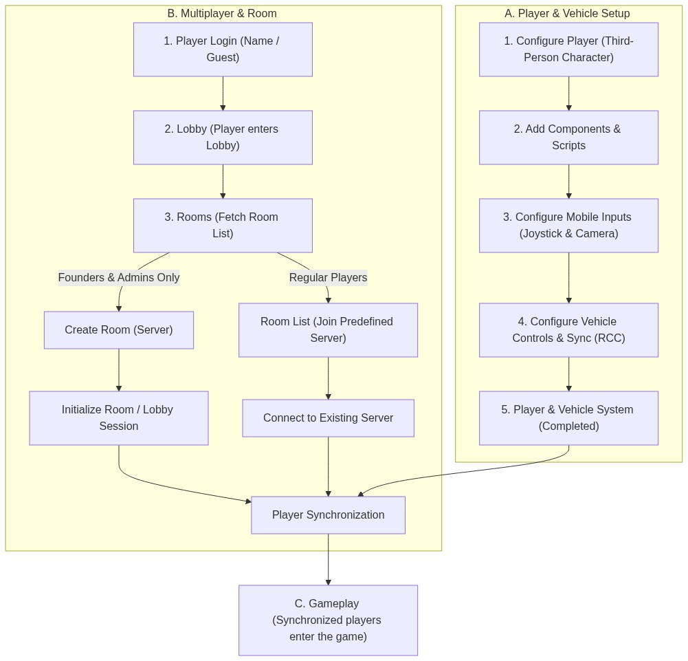
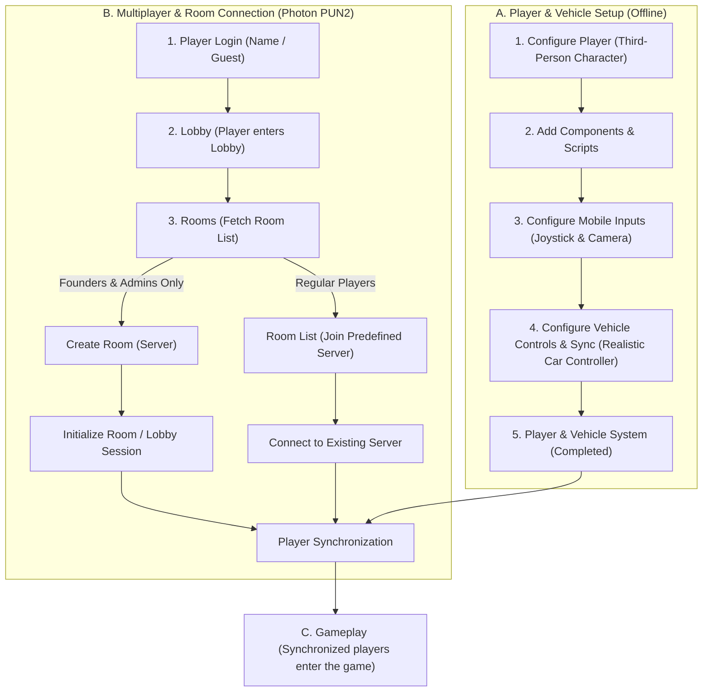

# Project Documentation: Night Life RP Prototype

## Milestone 1: Planning & Technical Setup

This document outlines the finalized project scope, technical architecture, network flow, asset selection, and detailed development roadmap for the **Night Life RP Prototype**. The prototype is designed to validate core mechanics—movement, camera controls, driving physics, and multiplayer synchronization—following the gameplay style of *OneState* and the visual style of *Gangstar Vegas*.

---

## 📌 1. Project Scope

### In-Scope:
* **Compact Test Map:** A compact testing environment (based on the Race Track asset from the Unity Asset Store).
* **One Playable Character:** A third-person playable character utilizing the Gangster Boss 3D model, with mobile-optimized virtual joystick controls and camera orbit.
* **Basic Animations:** Idle, walking, running, jumping, and vehicle entry/exit animations.
* **One Drivable Vehicle:** Full driving physics (powered by Realistic Car Controller) with trigger-based entry and exit mechanics.
* **Basic Multiplayer (Photon PUN2):** Support for 10–20 concurrent test players.
* **User Management:** Guest login, player spawning, reconnection support, and local storage of basic player data.
* **Roleplay (RP) Feature:** The **Identity (ID Card) System**. Player names above heads are hidden by default. Players can interact and introduce themselves to make their names temporarily visible to nearby players.
* **German UI/Localization:** The user interface, labels, buttons, and interaction prompts are fully translated into German (e.g., *"Einsteigen"*, *"Aussteigen"*, *"Ausweis zeigen"*).
* **Android Test Build:** Delivery of an installable APK for mobile playtesting.

### Client Feedback & Architectural Adjustments:
* **Restricted Room Creation:** Regular players **cannot** create rooms (game servers). The "Create Room" UI button is hidden/disabled for normal clients. Only founders and administrators are authorized to create rooms on the server. Regular players fetch the server list and join existing rooms directly.
* **No Dedicated Server Deployment Needed:** A new dedicated server infrastructure is not required. The prototype will integrate directly with the client's existing Photon/server environment using their App ID.

### Out-of-Scope (Excluded from Prototype):
* Full combat system (weapons, shooting, hit registers)
* In-game economy (cash, dirty money, banks, taxes)
* Proximity voice chat
* Interactive mobile phone system
* The complete large map (Los Angeles/Vice City hybrid)
* Other state/illegal factions (police tablets, medical reviving systems, mechanic shops, etc. will only be simulated via UI mockups if needed)

---

## 🛠️ 2. Game Development Principles & Project Structure

The project code is built using the **Single Responsibility Principle (SRP)**. Every component is designed to handle a single dedicated function (e.g., separating input detection from movement physics and network sync).

### Directory Structure (`Assets/Prototype/`)

```
Assets/
└── Prototype/
    ├── Prefabs/          # Networked player, vehicle, and UI canvas prefabs
    ├── Scenes/           # Compact test map scene (using the Race Track asset)
    ├── Scripts/          # C# Scripts organized by SRP
    │   ├── Core/         # Boot management and persistent settings
    │   ├── Player/       # Mobile touch input and movement controllers
    │   ├── UI/           # German localization and screen overlay managers
    │   ├── Vehicle/      # Car controller wrappers and entry/exit syncer
    │   └── RP/           # Identity (ID card) logic
    ├── UI/               # Fonts, sprites, and localization text sheets
    └── architecture_flow_chart.png   # Visual architecture diagram
```

### Core C# Source Files Created:
1. **[PrototypeManager.cs](file:///e:/test%20assignment/test%20assignment/Assets/Prototype/Scripts/Core/PrototypeManager.cs):** Initializes prototype state and applies localization settings.
2. **[PrototypePlayerController.cs](file:///e:/test%20assignment/test%20assignment/Assets/Prototype/Scripts/Player/PrototypePlayerController.cs):** Links virtual joysticks to the character's movement systems.
3. **[PrototypeVehicleController.cs](file:///e:/test%20assignment/test%20assignment/Assets/Prototype/Scripts/Vehicle/PrototypeVehicleController.cs):** Interfaces character triggers with the Realistic Car Controller script.
4. **[PrototypeUIManager.cs](file:///e:/test%20assignment/test%20assignment/Assets/Prototype/Scripts/UI/PrototypeUIManager.cs):** Displays German localized prompts on screen.
5. **[PrototypeIdentitySystem.cs](file:///e:/test%20assignment/test%20assignment/Assets/Prototype/Scripts/RP/PrototypeIdentitySystem.cs):** Operates the name-hiding and introduction mechanics.

---

## 📊 3. Network & Gameplay Flow

The following diagram illustrates the corrected workflow for character loading, mobile configurations, and restricted lobby joining:





---

## 🔌 4. Required Assets and Plugins

The project uses the exact asset plugins specified and approved:

* **Humanoid Character Model:** [Gangster Boss (Sketchfab)](https://sketchfab.com/3d-models/gangster-boss-e97810fa7398473aaf3465e11581fe7b)
* **Environment (Map):** [Race Track (Unity Asset Store)](https://assetstore.unity.com/)
* **HUD & Navigation:** [HUD-Navigation-System (Unity Asset Store)](https://assetstore.unity.com/packages/tools/gui/hud-navigation-system-103056)
* **Character Controller:** [Ju TPS 3 (Unity Asset Store)](https://assetstore.unity.com/packages/templates/systems/ju-tps-3-third-person-shooter-gamekit-vehicle-physics-251334)
* **Vehicle Physics:** [Realistic Car Controller (Unity Asset Store)](https://assetstore.unity.com/packages/tools/physics/realistic-car-controller-16296)
* **Multiplayer System:** [Photon PUN2 - Free (Unity Asset Store)](https://assetstore.unity.com/packages/tools/network/pun-2-free-119922)
* **VFX/Particles:** [Epic Toon FX (Unity Asset Store)](https://assetstore.unity.com/packages/vfx/particles/epic-toon-fx-57772)

---

## 📅 5. Detailed Development Plan (Milestones 1–4)

### Part 1 – Planning & Technical Setup (2 Days) - *Completed*
* Finalized the prototype scope and incorporated client's restricted joining rules.
* Configured the base project structure in Unity (Version 2022.3.0f1 LTS).
* Established custom directories and compiled base scripts.
* Generated technical diagrams and completed documentation.

### Part 2 – Basic Gameplay (1–2 Weeks)
* Import the **Race Track** asset to serve as the compact test map.
* Rig the **Gangster Boss** 3D model onto the **Ju TPS 3** controller.
* Configure touch controls for movement (joystick) and camera rotation (orbit swipe).
* Create the player spawn system.
* Set up the trigger mechanism using **Realistic Car Controller** to handle entry/exit transitions (prompting German UI text *"Einsteigen"*).

### Part 3 – Multiplayer & Backend (1–2 Weeks)
* Integrate **Photon PUN2** to synchronize player positions, rotations, and animation triggers.
* Implement a guest login screen.
* Disable room-creation inputs for normal players, allowing joining only.
* Connect clients directly to the client's existing test server infrastructure.
* Write a session manager to handle connection dropouts and automatic reconnection.

### Part 4 – RP Feature, Testing & Handover (2 Weeks)
* Implement the custom **Identity System** (name display visibility toggled via proximity and *"Sich vorstellen"* button).
* Apply German translation across all HUD overlays, menus, and system status logs.
* Optimize rendering for Android (batching static geometry, limiting lighting).
* Package and build the final Android APK file.
* Compile and deliver the documented source code to the client.

---

## 🧪 6. Verification & Test Plan

1. **Compilation Check:** Test Android platform compilation target inside Unity build settings.
2. **Access Control Verification:** Assert that a non-admin client cannot successfully send room-creation requests to Photon.
3. **Sync Verifications:** Verify that 10–20 players can coordinate and view animations, character positions, and driving physics accurately.
4. **UI Validation:** Audit German translations on mobile viewports for formatting and clipping.
