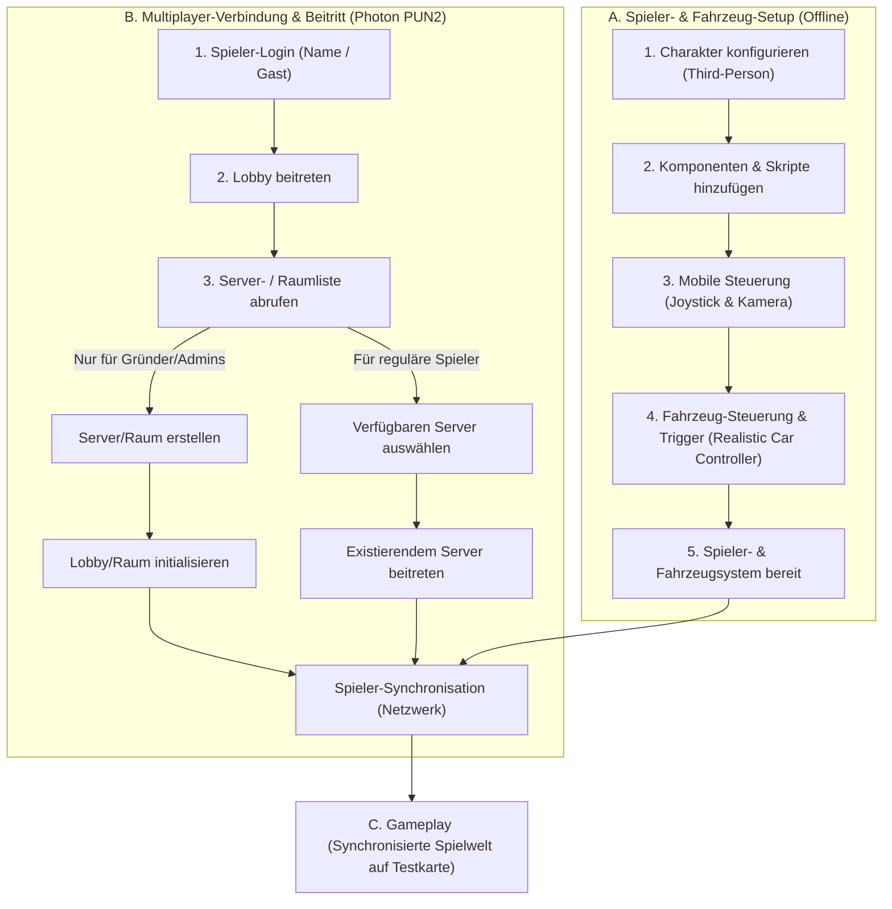

# Projekt-Dokumentation: Night Life RP Prototyp

## Meilenstein 1: Planung & Technisches Setup

Dieses Dokument enthält die vollständige Spezifikation, die korrigierte technische Architektur, den Netzfluss und den detaillierten Entwicklungsplan für den Prototyp von **Night Life RP**. Der Fokus liegt auf der Validierung der Kernmechaniken (Steuerung, Fahrzeug-Interaktion, Multiplayer-Synchronisation via Photon PUN2) basierend auf der Design-Referenz von *OneState* und dem visuellen Stil von *Gangstar Vegas*.

---

## 📌 1. Prototyp-Umfang (Scope)

### Im Prototyp enthalten (In-Scope):
* **Kompakte Testkarte:** Ein kompakter Test-Track/Kompakte Karte (basierend auf dem Race Track Asset aus dem Unity Asset Store).
* **Ein spielbarer Charakter:** Mit angepasster Kameraführung und Touch-Steuerung für Mobilgeräte, inspiriert von *OneState* und unter Verwendung des Gangster-Boss 3D-Modells.
* **Basis-Animationen:** Idle (Warten), Gehen, Laufen, Springen sowie Ein- und Aussteigen bei Fahrzeugen.
* **Ein fahrbares Auto:** Inklusive physikalischer Fahrbarkeit (Realistic Car Controller) und Synchronisation für das Ein-/Aussteigen.
* **Multiplayer-Grundlage (Photon PUN2):** Unterstützung für ca. 10–20 Testspieler gleichzeitig auf dem bestehenden Server des Kunden.
* **Spieler-Verwaltung:** Login-System (Gast-Zugang und Namenseingabe), Spawn-System, Reconnection-Handling und persistente Speicherung grundlegender Spielerdaten.
* **Ein definiertes RP-Feature:** Das **Identitäts-System** (Ausweis-System). Standardmäßig sind Spielernamen ausgeblendet. Erst durch gegenseitiges Vorstellen ("Sich vorstellen") wird der Name temporär sichtbar.
* **Deutsche Benutzeroberfläche (UI):** Alle Interaktions-Texte und Menüs im Spiel sind auf Deutsch.
* **Android-Testversion:** Ein fertiger APK-Build zum Testen auf Mobilgeräten.

### Explizite Korrekturen & Einschränkungen (Client-Feedback):
* **Keine Raumerstellung durch Spieler:** Spieler können *keine* eigenen Räume (Server) erstellen. Die Option zur Erstellung von Räumen wird im UI komplett ausgeblendet. Nur Gründer/Administratoren erstellen die Server/Räume. Spieler wählen aus der vorhandenen Serverliste aus und treten direkt bei.
* **Kein dedizierter Testserver-Aufbau:** Es wird kein neuer dedizierter Testserver benötigt, da der Kunde bereits über eine bestehende Server-Infrastruktur verfügt. Der Prototyp wird direkt mit diesem Server verbunden.

### Nicht im Prototyp enthalten (Out-of-Scope):
* Vollständiges Kampfsystem (Waffen & Schießen)
* Komplette Wirtschaft (Economy/Banken)
* Sprachchat (Voice Chat)
* Smartphone-System (Apps, Anrufe)
* Vollständige Großkarte (LA / Vice City Mix)
* Alle Fraktionen (Polizei-Tablet, MD-Revive-System etc. werden in dieser Phase nur in Form von Prototyp-Mockups simuliert)

---

## 🛠️ 2. Technische Architektur & Projektstruktur

Die Entwicklung folgt dem **Single Responsibility Principle (Prinzip der eindeutigen Verantwortlichkeit)**, um eine saubere Modularität und Skalierbarkeit für spätere Erweiterungen zu gewährleisten.

### Verzeichnisstruktur (`Assets/Prototype/`)

```
Assets/
└── Prototype/
    ├── Prefabs/          # Netzwerk-Player, Fahrzeuge und UI-Canvas
    ├── Scenes/           # Die kompakte Testkarten-Szene
    ├── Scripts/          # C#-Skripte für die Logik (SRP-konform)
    │   ├── Core/         # Start- und Steuerungs-Manager
    │   ├── Player/       # Bewegungs- und Animationssteuerung (Mobile)
    │   ├── UI/           # Deutsche Benutzeroberfläche und Lokalisierung
    │   ├── Vehicle/      # Ein-/Ausstiegslogik und Fahrzeug-Synchronisation
    │   └── RP/           # Identitäts-System (Ausweis)
    └── UI/               # Sprites, Schriftarten und UI-Elemente
```

### Initialisierte Skripte (Kern-Struktur):
1. **[PrototypeManager.cs](file:///e:/test%20assignment/test%20assignment/Assets/Prototype/Scripts/Core/PrototypeManager.cs):** Verwaltet den Spielstart und globale Prototyp-Einstellungen.
2. **[PrototypePlayerController.cs](file:///e:/test%20assignment/test%20assignment/Assets/Prototype/Scripts/Player/PrototypePlayerController.cs):** Verknüpft die mobile Joystick-Steuerung mit dem `JUCharacterController`.
3. **[PrototypeVehicleController.cs](file:///e:/test%20assignment/test%20assignment/Assets/Prototype/Scripts/Vehicle/PrototypeVehicleController.cs):** Regelt die Fahrzeugphysik und den Übergang des Spielers in den Fahrzustand.
4. **[PrototypeUIManager.cs](file:///e:/test%20assignment/test%20assignment/Assets/Prototype/Scripts/UI/PrototypeUIManager.cs):** Steuert die deutschsprachigen UI-Meldungen wie *"Fahrzeug betreten"* oder *"Ausweisen"*.
5. **[PrototypeIdentitySystem.cs](file:///e:/test%20assignment/test%20assignment/Assets/Prototype/Scripts/RP/PrototypeIdentitySystem.cs):** Steuert das Verstecken/Anzeigen von Spielernamen und die Ausweis-Logik.

---

## 📊 3. Netzwerk- und Spielfluss (Spielfluss-Architektur)

Das folgende Diagramm zeigt den angepassten Ablauf für das Laden des Charakters und den Multiplayer-Beitritt (ohne Raumerstellung für Spieler):




---

## 🔌 4. Asset- & Plugin-Auswahl

Für die Umsetzung werden die vom Kunden freigegebenen Assets und Plugins verwendet:

* **Spielfigur (3D-Modell):** [Gangster Boss (Sketchfab)](https://sketchfab.com/3d-models/gangster-boss-e97810fa7398473aaf3465e11581fe7b) (Visuelle Referenz & Charaktermodell).
* **Testkarte/Umgebung:** [Race Track (Unity Asset Store)](https://assetstore.unity.com/) (Kompakte Test-Umgebung).
* **Navigation & Minimap:** [HUD-Navigation-System (Unity Asset Store)](https://assetstore.unity.com/packages/tools/gui/hud-navigation-system-103056) (Kompass, HUD und Orientierung).
* **Charakter-Physik & Animationen:** [Ju TPS 3 (Unity Asset Store)](https://assetstore.unity.com/packages/templates/systems/ju-tps-3-third-person-shooter-gamekit-vehicle-physics-251334) (Basis-Drittperson-Controller, Kamera und Ein-/Ausstiegsmechaniken).
* **Fahrzeug-Physik:** [Realistic Car Controller (Unity Asset Store)](https://assetstore.unity.com/packages/tools/physics/realistic-car-controller-16296) (Fahrzeugsteuerung und Fahrverhalten).
* **Multiplayer-Synchronisation:** [Photon PUN2 - Free (Unity Asset Store)](https://assetstore.unity.com/packages/tools/network/pun-2-free-119922) (Netzwerk-Synchronisation).
* **Partikel-Effekte:** [Epic Toon FX (Unity Asset Store)](https://assetstore.unity.com/packages/vfx/particles/epic-toon-fx-57772) (Grafische Partikeleffekte für Fahrzeug- und Spielerinteraktionen).

---

## 📅 5. Detaillierter Entwicklungsplan (Milestones 1–4)

### Part 1 – Planung & Technisches Setup (2 Tage) - *Aktuelle Phase (Abgeschlossen)*
* Finalisierung des Prototyp-Umfangs und Einarbeitung des Client-Feedbacks.
* Definition der technischen Architektur, des Netzflusses und der Projektstruktur.
* Vorbereitung der Entwicklungsumgebung (Unity 2022.3.0f1 LTS) und Bereitstellung der Verzeichnisstruktur.
* Dokumentation des Entwicklungsplans.

### Part 2 – Basic Gameplay (1–2 Wochen)
* Integration des **Race Track**-Umgebungs-Assets als kompakte Testkarte.
* Einrichtung der Spielfigur (Gangster Boss Mesh in den **Ju TPS 3** Controller integrieren).
* Anpassung der Touch-Steuerung für mobile Geräte und Ausrichtung des Kamerasystems.
* Implementierung des Player Spawn-Systems.
* Integration des **Realistic Car Controller** für das Testfahrzeug inklusive Ein- und Ausstiegsauslösern (Einblenden des deutschen Texts *"Einsteigen"* / *"Aussteigen"*).

### Part 3 – Multiplayer & Backend (1–2 Wochen)
* Integration von **Photon PUN2** zur Synchronisation von Spielerpositionen, Blickrichtungen und Animationen.
* Login-System (Gast-Zugang und Namenseingabe im Hauptmenü).
* Verbindung der Clients mit dem vorhandenen Testserver des Kunden.
* Deaktivierung der Raumerstellungs-Schaltfläche für reguläre Spieler (nur über Admin-Accounts/Gründer steuerbar).
* Session- und Reconnection-System zur automatischen Wiederverbindung bei Netzverlust.
* Persistente Speicherung grundlegender Spielerdaten.

### Part 4 – RP Feature, Testing & Handover (2 Wochen)
* Implementierung des Ausweis-Systems (Identitäts-System): Namen über den Köpfen sind unsichtbar. Durch Interaktion ("Sich vorstellen") wird der Name temporär für das Gegenüber freigeschaltet.
* Komplette Einarbeitung der deutschen Benutzeroberfläche und Lokalisierung aller Spielmenüs.
* Fehlerbehebung, Performance-Optimierung (Draw Call Batching, mobile Shader-Anpassung).
* Bereitstellung des installierbaren Android-Testbuilds (.apk).
* Bereitstellung des sauberen Quellcodes, der Systemdokumentation und finale Projektübergabe.

---

## 🧪 6. Verifikationsplan

1. **Lokaler Kompilierungstest:** Verifikation, dass der Android-Build ohne C#-Compilerfehler generiert wird.
2. **Server-Konnektivitätstest:** Verbindungsprüfung mit dem vom Kunden bereitgestellten Testserver (kein Neuaufbau erforderlich).
3. **Rollenspezifischer Raumbeitritt:** Test, dass reguläre Testspieler keine Räume erstellen können und nur Admins/Gründer Räume auf dem Server bereitstellen dürfen.
4. **Physik- und Animations-Synchronisation:** Test der korrekten Animations- und Positions-Replikation von Charakter und Fahrzeug unter ca. 10–20 Spielern.
