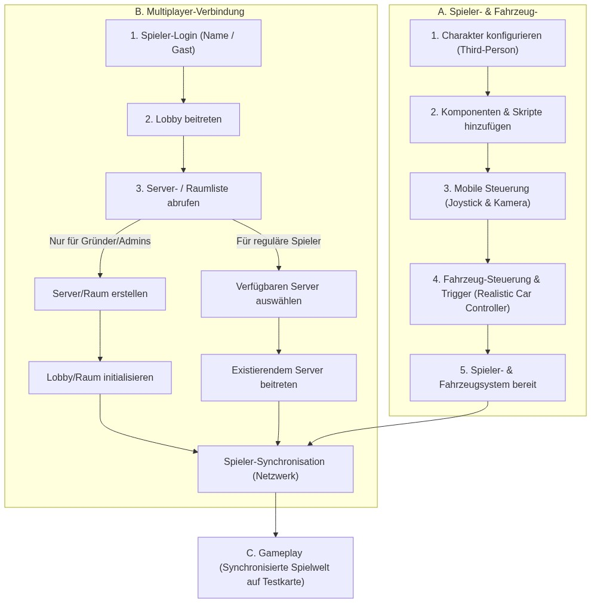
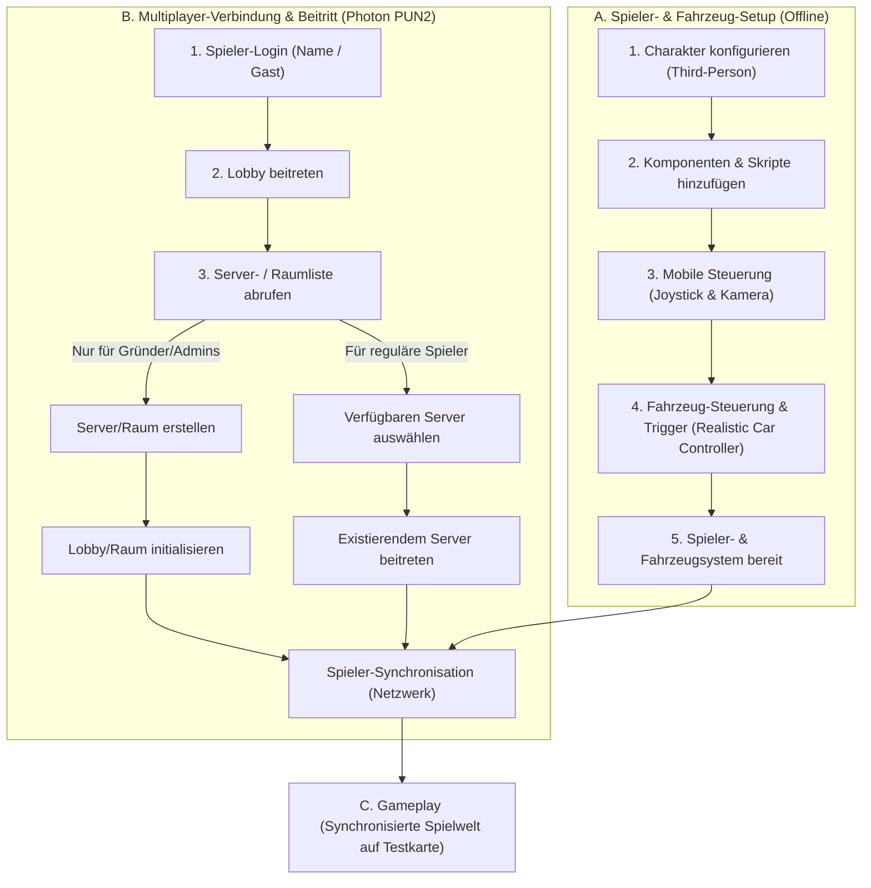

# Night Life RP – Prototyp Dokumentation (Meilenstein 1)

Willkommen im offiziellen Repository des **Night Life RP** Prototyps. Dieses Dokument dient als zentrale README und enthält alle technischen Spezifikationen, Architekturentwürfe, Asset-Listen und den Entwicklungsplan in deutscher Sprache.

---

## 📌 1. Projekt-Übersicht & Konzept

**Night Life RP** ist ein Multiplayer-Roleplay-Spiel, das speziell für Mobilgeräte optimiert wird. Das Gameplay orientiert sich an *OneState* (insbesondere Bewegung, Touch-Steuerung und Netzwerk-Lobby), während die visuelle Präsentation und Grafik-Referenz an *Gangstar Vegas* angelehnt ist.

Der Prototyp dient dazu, die Kernmechaniken der Spielwelt (Dritte-Person-Steuerung, Fahrzeuginteraktion, Multiplayer-Synchronisation) zu testen und zu validieren, bevor größere Systeme implementiert werden.

---

## 📋 2. Prototyp-Umfang (Scope)

### Im Prototyp enthalten (In-Scope):
* **Kompakte Testkarte:** Eine kleine, performante Testumgebung basierend auf dem *Race Track*-Asset aus dem Unity Asset Store.
* **Spielbarer Charakter:** Ein spielbarer Avatar (unter Verwendung des *Gangster Boss*-Modells) mit einer für Mobilgeräte optimierten Touch-Steuerung und Third-Person-Kamera.
* **Kern-Animationen:** Idle (Warten), Gehen, Laufen, Springen sowie das Ein- und Aussteigen aus Fahrzeugen.
* **Ein fahrbares Auto:** Ein Auto mit realistischer Fahrphysik (Realistic Car Controller) und Synchronisation des Ein-/Ausstiegs.
* **Basis-Multiplayer (Photon PUN2):** Netzwerk-Synchronisation für ca. 10–20 Spieler gleichzeitig.
* **Spieler-Verwaltung:** Login-System (Gast-Zugang und Namenseingabe), Spawn-System, Reconnection-Handling (automatische Wiederverbindung bei Verbindungsverlust) und Speicherung grundlegender Spielerdaten.
* **Ein definiertes RP-Feature:** Das **Identitäts-System (Ausweis)**. Spielernamen über den Köpfen sind unsichtbar. Erst durch die Interaktion *"Sich vorstellen"* wird der Name für den jeweiligen Mitspieler temporär sichtbar.
* **Deutsche Lokalisierung:** Alle Menüs, HUDs und Interaktionsprompts sind vollständig auf Deutsch (z. B. *"Einsteigen"*, *"Aussteigen"*, *"Ausweis zeigen"*).
* **Android Test-Build:** Bereitstellung einer installierbaren APK-Datei für das Testen auf Mobilgeräten.

### Wichtige Korrekturen (Client-Feedback eingearbeitet):
1. **Eingeschränkte Raumerstellung:** Spieler können **keine** eigenen Räume (Server) erstellen. Die Schaltfläche zur Raumerstellung ist im Client deaktiviert/ausgeblendet. Nur die Gründer (Gründer/Admins) erstellen Räume. Reguläre Spieler sehen die Serverliste und treten einem bestehenden Server bei.
2. **Keine neue Server-Bereitstellung:** Es ist kein neuer dedizierter Testserver erforderlich. Die Verbindung erfolgt direkt mit der bestehenden Server-Infrastruktur des Kunden über dessen Photon App ID.

---

## 🛠️ 3. Technische Architektur & Projektstruktur

Das Projekt wird streng nach dem **Single Responsibility Principle (SRP)** entwickelt, um eine hohe Codequalität und einfache Skalierbarkeit zu gewährleisten.

### Verzeichnisstruktur im Projekt (`Assets/Prototype/`)

```
Assets/
└── Prototype/
    ├── Prefabs/          # Netzwerk-Player, Fahrzeuge und UI-Canvas
    ├── Scenes/           # Die kompakte Testkarten-Szene (Race Track)
    ├── Scripts/          # SRP-konforme C#-Skripte
    │   ├── Core/         # Start- und globale Einstellungen (PrototypeManager.cs)
    │   ├── Player/       # Mobile Steuerung und Kamera (PrototypePlayerController.cs)
    │   ├── UI/           # Deutsche UI-Texte und Buttons (PrototypeUIManager.cs)
    │   ├── Vehicle/      # Ein-/Ausstiegs-Trigger und RCC-Integration (PrototypeVehicleController.cs)
    │   └── RP/           # Namensanzeige und Ausweis-Logik (PrototypeIdentitySystem.cs)
    ├── UI/               # Schriften, Symbole und UI-Layouts
    ├── architecture_flow_chart.png   # Visuelles Ablaufdiagramm (Englisch)
    └── architektur_ablaufplan.png    # Visuelles Ablaufdiagramm (Deutsch)
```

### Beschreibung der Kern-Skripte:
* **[PrototypeManager.cs](file:///e:/test%20assignment/test%20assignment/Assets/Prototype/Scripts/Core/PrototypeManager.cs):** Startet das Spiel und initialisiert die Netzwerkeinstellungen.
* **[PrototypePlayerController.cs](file:///e:/test%20assignment/test%20assignment/Assets/Prototype/Scripts/Player/PrototypePlayerController.cs):** Steuert die Übersetzung von virtuellen Joysticks in Bewegungsdaten.
* **[PrototypeVehicleController.cs](file:///e:/test%20assignment/test%20assignment/Assets/Prototype/Scripts/Vehicle/PrototypeVehicleController.cs):** Verwaltet die Interaktion mit dem Realistic Car Controller beim Ein- und Aussteigen.
* **[PrototypeUIManager.cs](file:///e:/test%20assignment/test%20assignment/Assets/Prototype/Scripts/UI/PrototypeUIManager.cs):** Lokalisierungs-Manager für deutsche In-Game-Meldungen.
* **[PrototypeIdentitySystem.cs](file:///e:/test%20assignment/test%20assignment/Assets/Prototype/Scripts/RP/PrototypeIdentitySystem.cs):** Regelt das Ein-/Ausblenden der Spielernamen.

---

## 📊 4. Netzwerk- und Spielfluss (Spielfluss-Architektur)

Das folgende Diagramm visualisiert den genauen Ablauf für das Laden des Charakters und den Multiplayer-Beitritt (Raumerstellung nur für Admins/Gründer):





---

## 🔌 5. Freigegebene Assets & Plugins

Das Projekt verwendet ausschließlich die vom Kunden freigegebenen Assets:

* **Charaktermodell (Gangster):** [Gangster Boss (Sketchfab)](https://sketchfab.com/3d-models/gangster-boss-e97810fa7398473aaf3465e11581fe7b)
* **Umgebung/Testkarte:** [Race Track (Unity Asset Store)](https://assetstore.unity.com/)
* **Minimap & Navigation:** [HUD-Navigation-System (Unity Asset Store)](https://assetstore.unity.com/packages/tools/gui/hud-navigation-system-103056)
* **Third-Person Controller:** [Ju TPS 3 (Unity Asset Store)](https://assetstore.unity.com/packages/templates/systems/ju-tps-3-third-person-shooter-gamekit-vehicle-physics-251334)
* **Fahrzeugsteuerung:** [Realistic Car Controller (Unity Asset Store)](https://assetstore.unity.com/packages/tools/physics/realistic-car-controller-16296)
* **Multiplayer-Synchronisation:** [Photon PUN2 - Free (Unity Asset Store)](https://assetstore.unity.com/packages/tools/network/pun-2-free-119922)
* **Effekte/VFX:** [Epic Toon FX (Unity Asset Store)](https://assetstore.unity.com/packages/vfx/particles/epic-toon-fx-57772)

---

## 📅 6. Entwicklungsplan & Meilensteine

### Meilenstein 1 – Planung & Technisches Setup (2 Tage) - *Abgeschlossen*
* Finalisierung des Umfangs, Einarbeitung des Client-Feedbacks zur Raumerstellungs-Einschränkung.
* Erstellung der Verzeichnisstruktur und Basis-Skripte.
* Dokumentation der Architektur und Erstellung der Ablaufdiagramme.

### Meilenstein 2 – Basic Gameplay (1–2 Wochen)
* Import des **Race Track**-Assets.
* Integration des **Gangster Boss**-Modells in das **Ju TPS 3**-Controller-System.
* Mobile Anpassungen: Joystick und Touch-Gesten für Kamera-Kollision und Sicht.
* Einrichtung des Spawn-Systems.
* Integration des **Realistic Car Controller** für das Testfahrzeug (inkl. Ein-/Ausstiegsanimationen und deutschem HUD).

### Meilenstein 3 – Multiplayer & Backend (1–2 Wochen)
* Integration von **Photon PUN2**.
* Synchronisation von Position, Rotation und Animationen der Spieler.
* Verbindung aller Clients mit der bestehenden Server-Infrastruktur des Kunden (Verwendung der App ID).
* Einschränkung der Raumerstellung: Deaktivierung der UI-Buttons für normale Spieler.
* Session- und Reconnection-System (automatischer Wiedereintritt nach Signalverlust).

### Meilenstein 4 – RP-Feature, Testing & Übergabe (2 Wochen)
* Implementierung des Ausweis-Systems: Spieler-Namensschilder über den Köpfen ausblenden. Hinzufügen der Interaktion *"Sich vorstellen"* zur temporären Namensfreigabe.
* Komplette Übersetzung aller In-Game-Texte ins Deutsche.
* APK-Kompilierung für Android.
* Performance-Optimierungen und Übergabe des sauberen Quellcodes mit der Enddokumentation.

---

## 🧪 7. Verifikationsplan

* **C#-Kompilierung:** Sicherstellen, dass das Projekt auf der Unity-Version **2022.3.0f1 LTS** fehlerfrei kompiliert.
* **Serververbindung:** Anmeldung im Photon-Netzwerk unter Verwendung der Kunden-App-ID.
* **Rollenberechtigung:** Nachweisen, dass normale Spieler keine Räume erstellen können.
* **Multiplayer-Test:** Test mit 10–20 simulierten Verbindungen zur Überprüfung der Synchronisation.
